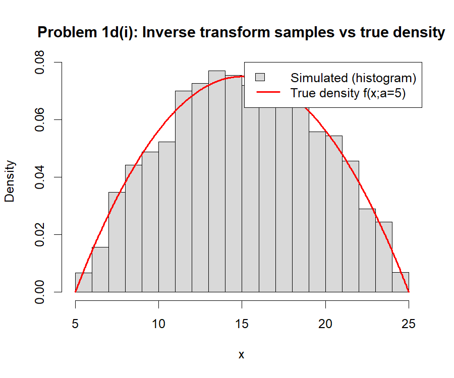
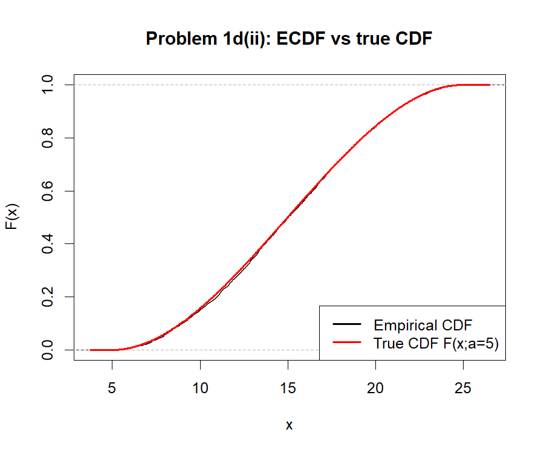
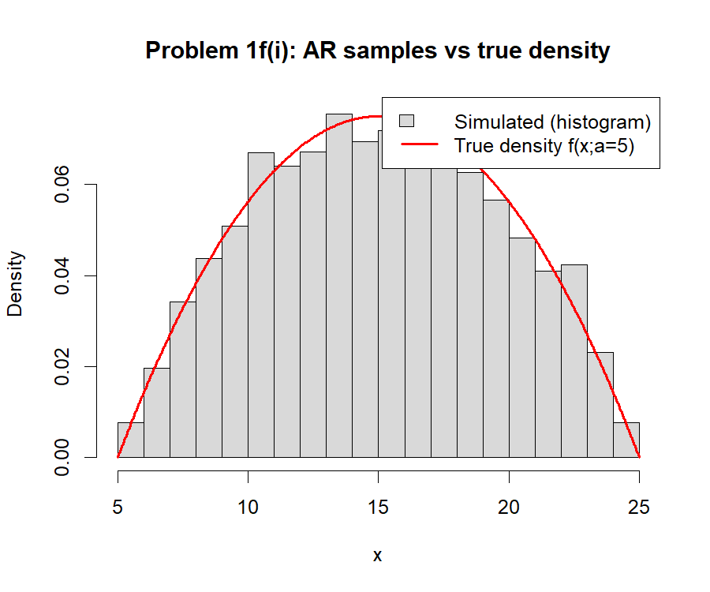
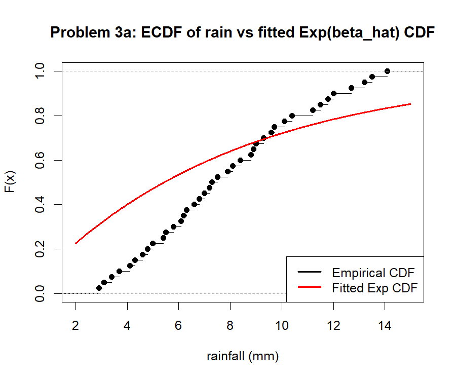
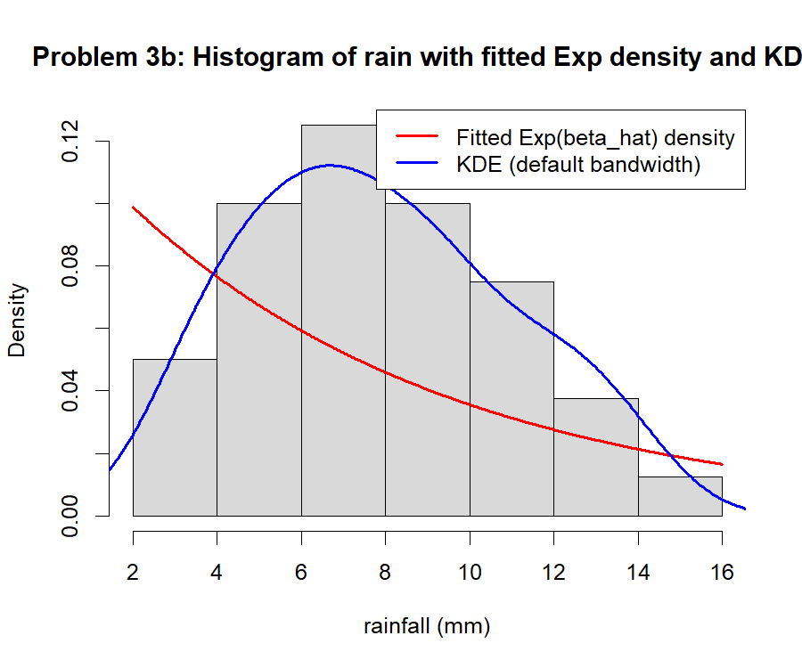
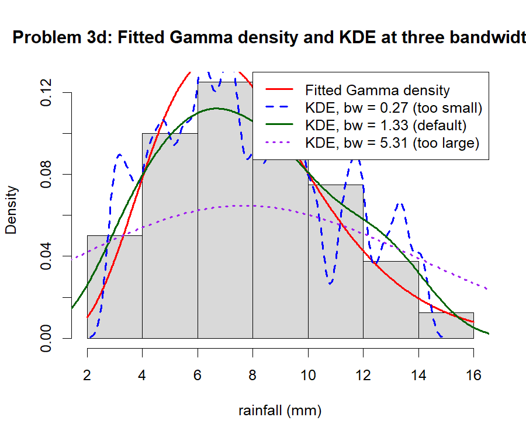
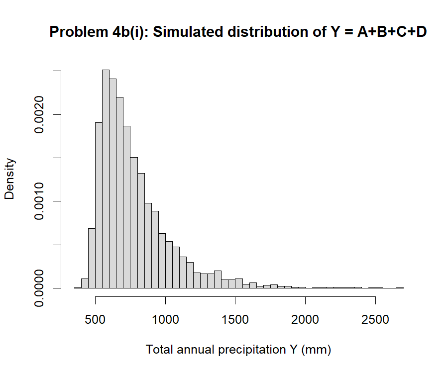

# sta510-statistical-modelling-simulation-2026

Course material and assignments for STA510 Statistical modelling and simulation, autumn 2026.

## Mandatory assignment 1

Wind-speed simulation (inverse transform + acceptance-rejection), exponential
rainfall MLE/CI, ECDF/KDE/gamma model fitting, and Monte Carlo simulation of a
sum of independent random variables. Source: [mandatory1/mandatory1.R](mandatory1/mandatory1.R)
(run with `Rscript mandatory1.R`, seed `510`), full report:
[mandatory1/mandatory1_report.pdf](mandatory1/mandatory1_report.pdf).

### Figures

| | |
| --- | --- |
|  |  |
| Problem 1d(i): inverse-transform samples vs true density | Problem 1d(ii): ECDF vs true CDF |
|  |  |
| Problem 1f(i): acceptance-rejection samples vs true density | Problem 3a: ECDF of rain vs fitted Exp(β̂) CDF |
|  |  |
| Problem 3b: rain histogram, fitted Exp density and KDE | Problem 3d: fitted Gamma density and KDE at three bandwidths |
|  | |
| Problem 4b(i): simulated distribution of Y = A+B+C+D | |
