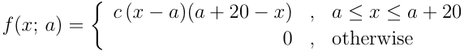
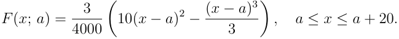
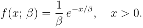

_STA510 Statistical modelling and simulation, autumn 2026._ 

## **Mandatory assignment 1** 

Deadline: Saturday September 27th at 23:59 (Norwegian time). 

Read carefully through the information about the mandatory assignments on Canvas. Notice in particular that the assignments should be solved individually. 

Hand in on Canvas. Submissions should be of **either** of the following types 

- ˆ Submit two files: One pdf-file with a report containing the answers to the theory questions, and one R-file including the R-code. 

- ˆ Submit two files: One R markdown (Rmd) file containing both theory answers and R-code, and a pdf-file with the output you obtain when running (knitting) your R markdown file. See tutorial to get started. 

The first line of R-code should be: `rm(list=ls())` . Check that the Rmd/R-code file runs before you submit it. Use comments in the R-code to clearly identify which question each part of the R-code belongs to. Also try to add some comments to explain important parts of the code. The file ending of the R-code file should be .Rmd, .R or .r. The report can be handwritten and scanned to pdf-file, or written in your choice of text editor and converted to pdf. Cite the sources you use. 

Problems marked with an[R] should be solved in R, the others are theory questions. Each of the subproblems, e.g., points 1a), 1b), 2a), and so on, is given the same weight. 

## **Problem 1:** 

Meteorologists in Stavanger are studying daily maximum wind speeds (in m/s) during autumn. Based on historical records, it is believed that the daily maximum wind speed _X_ on a randomly chosen autumn day never falls below a minimum threshold _a >_ 0 m/s and never exceeds _a_ + 20 m/s. To model this behaviour, the following probability density function is proposed: 




**[Image: mandatory1_2026.pdf-0001-11.png (572x63, 7.0KB)]**


where _c >_ 0 is a normalising constant. 

- a) Show that _f_ ( _x_ ; _a_ ) is a valid pdf by finding the constant _c_ (expressed in terms of _a_ ). _Hint: Use the substitution u_ = _x − a._ 

- b) Compute the expected daily maximum wind speed E( _X_ ) and the variance Var( _X_ ), both expressed as functions of _a_ . Interpret your results in the context of wind speed in Stavanger. 

1 

- c) Show that the cumulative distribution function _F_ ( _x_ ; _a_ ) for _a ≤ x ≤ a_ + 20, expressed as a function of _a_ , is given by 




**[Image: mandatory1_2026.pdf-0002-01.png (649x64, 7.5KB)]**


- d)[R] Recall from the lectures that if _U ∼ U_ (0 _,_ 1), then _X_ = _F[−]_[1] ( _U_ ). To apply this, we need to solve _F_ ( _X_ ; _a_ ) = _U_ for _X_ . Since _F_ ( _x_ ; _a_ ) is a cubic polynomial in ( _x − a_ ), inverting it analytically is not straightforward and leads to a complex expression involving trigonometric functions. Instead, we can solve _F_ ( _X_ ; _a_ ) = _U_ numerically in R using `uniroot()` : for each `-` 

- realisation _u_ of _U_ , the call `uniroot(function(x) F(x,a) u, lower=a, upper=a+20)` finds the unique _X_ such that _F_ ( _X_ ; _a_ ) = _u_ , i.e. _X_ = _F[−]_[1] ( _U_ ; _a_ ). 

   - Using this approach, write an R function that implements _F[−]_[1] ( _p_ ; _a_ ) via `uniroot` , and use it to generate _n_ = 5000 random wind speed samples with _a_ = 5. Then: 

   - i) Plot a histogram of the simulated values using the Scott rule and overlay the true density _f_ ( _x_ ; _a_ = 5). Comment on the fit. 

   - ii) Plot the empirical CDF (ECDF) and overlay the true CDF _F_ ( _x_ ; _a_ = 5). Comment on the fit. 

- e) As an alternative to the inverse transform method, we can use the Acceptance-Rejection (AR) method to simulate from _f_ ( _x_ ; _a_ ). We use a uniform proposal distribution _g_ ( _x_ ) on [ _a, a_ + 20]. 

   - i) Find the constant _M_ such that _f_ ( _x_ ; _a_ ) _≤ M · g_ ( _x_ ) for all _x_ . 

   - ii) Describe the AR algorithm step by step for this specific choice of _f_ and _g_ . 

   - iii) What is the theoretical acceptance rate of the algorithm? How many proposals do you expect to need in order to generate _n_ = 5000 accepted samples? 

- f)[R] Implement the Acceptance-Rejection algorithm from e) in R with _a_ = 5 and generate _n_ = 5000 samples. Then: 

   - i) Plot a histogram of the simulated values and overlay the true density _f_ ( _x_ ; _a_ = 5). Comment on the fit. 

   - ii) Report the empirical acceptance rate from your simulation and compare it to the theoretical value from e)iii). 

   - iii) Compare briefly the two simulation approaches from d) and f): when would you prefer one over the other? 

2 

## **Problem 2:** 

A coastal weather station near Stavanger records daily rainfall (in mm) over a long period. Rainfall on a wet day is modelled by an Exponential distribution with scale parameter _β >_ 0, i.e. with pdf: 




**[Image: mandatory1_2026.pdf-0003-02.png (293x59, 3.5KB)]**


A sample of _n_ = 40 wet-day rainfall measurements (in mm) is given below: 

```
rain<-c(3.1,7.2,5.4,12.0,8.8,4.3,9.6,6.1,11.2,2.9,
7.5,14.1,5.0,9.3,6.8,10.4,3.7,8.1,13.5,4.6,
6.3,11.8,7.9,5.5,9.0,12.7,4.1,8.4,6.6,10.1,
3.4,7.0,5.8,13.2,9.7,6.2,11.5,4.8,8.9,7.3)
```

- iid 

- a) Based on _X_ 1 _, . . . , Xn ∼_ Exp( _β_ ), show that the Maximum Likelihood Estimator (MLE) of _β n_ 

- is _β_[�] = _X_[¯] = _n_[1] � _i_ =1 _[X][i]_[.] 

- b) 

   - i) Is _β_[�] an unbiased estimator of _β_ ? Justify your answer. 

   - ii) Show that Var( _β_[�] ) = _β_[2] _/n_ . 

- c) How many wet-day rainfall measurements would we need to collect to be 95% confident that � _β_ falls within 1 mm of the true _β_ ? Justify your answer using the CLT. 

- d)[R] Using the data vector `rain` given above: 

   - i) Compute the MLE _β_[�] and report it. 

   - ii) Construct an approximate 95% confidence interval for _β_ using the CLT. Report and interpret the interval. 

3 

## **Problem 3:** 

We continue with the rainfall data from Problem 2 and study the distribution of wet-day rainfall more carefully using graphical tools. 

- a)[R] Plot the ECDF of the `rain` data. On the same plot, overlay the theoretical CDF of an Exp( _β_[�] ) distribution using your MLE from Problem 2d). 

- b)[R] Produce a histogram of the `rain` data (using Scott’s rule for bin width). On the same plot, overlay: 

   - i) The fitted Exponential pdf with parameter _β_[�] . 

   - ii) A Kernel Density Estimate (KDE) using R’s `density()` function with the default bandwidth. 

- c) Based on your observations in a) and b): 

   - i) Does the Exponential distribution provide a good fit to the rainfall data? Argue and explain. 

   - ii) Can you think of an alternative distribution that might provide a better fit? Briefly justify your choice. 

- d)[R] Estimate the parameters of your chosen distribution from c)ii) using `fitdistr()` from — 

- the `MASS` package in R. This function finds the MLEs numerically it can be called as `fitdistr(rain, "name of distribution")` . Produce a plot with the histogram of the `rain` data and overlay: 

   - i) The fitted density from your alternative model. 

   - ii) KDE curves using three bandwidths: one clearly too small, one default (via `bw.nrd0()` ), and one clearly too large. 

Comment on how the alternative parametric model compares to the KDE across the three bandwidths, and what this tells you about the bias-variance tradeoff in bandwidth selection. 

4 

## **Problem 4:** 

The total annual precipitation at the Stavanger weather station is modelled as the sum of contributions from four independent sources: orographic rainfall _A_ , frontal rainfall _B_ , convective rainfall _C_ , and snowfall _D_ . Their distributions are: 

|Source|Random variable|Distribution|
|---|---|---|
|Orographic|_A_|Normal with _µ_= 400, _σ_2 = 900|
|Frontal|_B_|Exponential with mean 250|
|Convective|_C_|_U_(50_,_150)|
|Snowfall|_D_|80 with probability 0_._3, 0 with probability 0_._7|


All values are in mm. The total annual precipitation is _Y_ = _A_ + _B_ + _C_ + _D_ . The four sources are assumed to be independent. 

- a) Find the expected total annual precipitation E( _Y_ ) and the standard deviation SD( _Y_ ). 

- b)[R] Estimate the distribution of _Y_ by simulation using _n_ = 5000 samples. 

   - i) Draw a histogram of the simulated values of _Y_ . 

   - ii) What are the estimated mean and standard deviation of _Y_ ? Compare with your analytical results from a). 

   - iii) Estimate the probability _P_ ( _Y >_ 1050) by simulation and interpret the result. 

5 


---

## Extracted Images

| # | File | Dimensions | Size |
|---|------|------------|------|
| 1 | mandatory1_2026.pdf-0001-11.png | 572x63 | 7.0KB |
| 2 | mandatory1_2026.pdf-0002-01.png | 649x64 | 7.5KB |
| 3 | mandatory1_2026.pdf-0003-02.png | 293x59 | 3.5KB |
